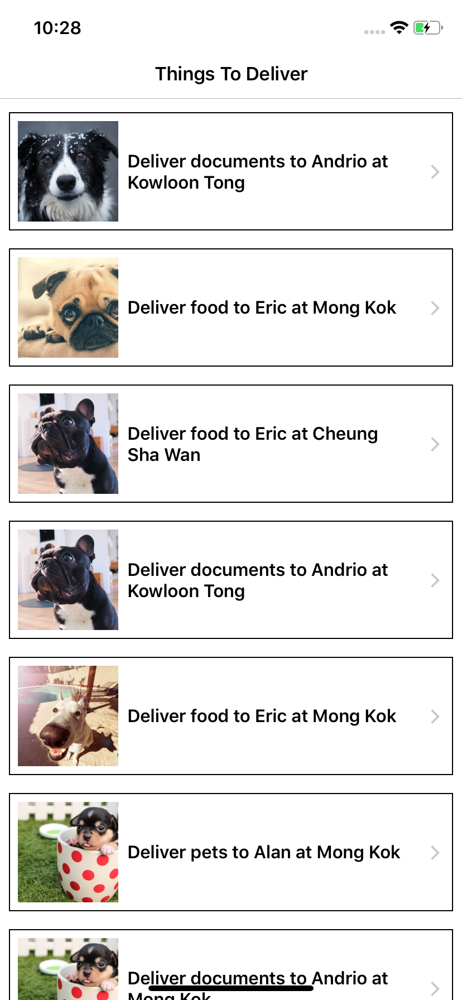
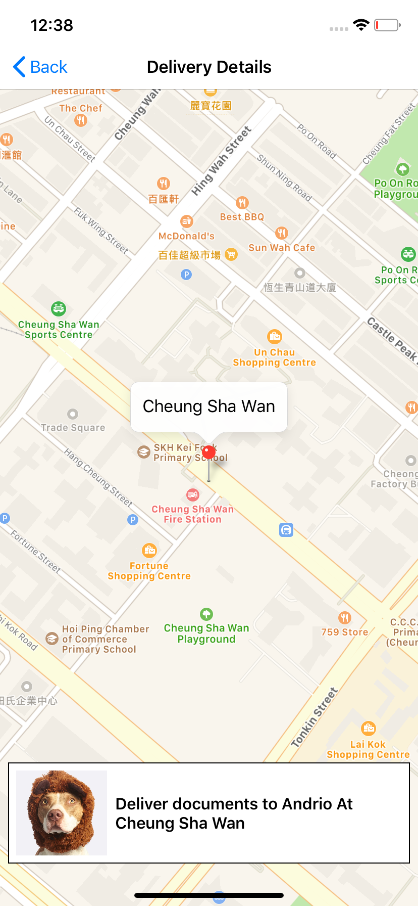
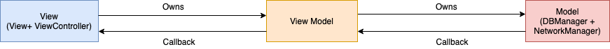

## DeliveryApp (iOS)
A project shows a list of deliveries, including receivers photo and item description and also check the delivery location on map.

# Application Screenshots

# Requirement
- iOS 10.0+
- Xcode 10.2

# Installation
- To run the project :
- Open podfile from project repository 
- Open terminal and cd to the directory containing the Podfile
- Run the "pod install" command
- Open DeliveryApp.xcworkspace 

# Language 
Swift 5.0

# Version
1.0 

# Design Pattern Used
## MVVM
Model-View-ViewModel (MVVM) is a structural design pattern that separates objects into three distinct groups:

__View:__ Display visual elements and controls on the screen. In iOS View layer is represented by View and ViewController.

__ViewModel:__ Transform model information into values that can be displayed on a view. It interacts with the DataManager layer to retrieve the data. This layer will notify the changes in data to the View layer using completion handler.

__DBManager:__ This is between ViewModel and Model. DBManager provides data intelligently to the view model. If data is already stored in Realm, it will return that data to view model. If data is not present in Realm, it will fetch the data from API and return it back to view model and simultaneously store the data in Realm.

__NetworkManger:__ This class interacts remotely. It retrieves the data from the server and map into the model.

__Model:__ hold application data. 

# Features
## MapView
- Used iOS Mapkit framework to show map.

## Data Caching
- Realm is used for data caching. Items fetched from server are displayed to UI and  then save it into Realm Database.
- If data is available in Realm then it fetchs data from Realm and displayed on UI.

## Pull to Refresh
- If network available - fetches data from starting index from server, if data is available  that deletes all the previous records from Realm Database, and  then it is displayed new data to UI and  then save it into Realm Database.
- If network not available - Error alert shows of No internet connection.

## Pagination
- Fetching data from starting index and when a user goes to bottom of the table view, hits request for fetching data, then displayed in the UI and then save it into Ream Database.

## Data Handling
- First time get data from the server, then showing that data to UI and then save the data to Realm Db next time user come back to app again, fetches data from Realm Db then displayed in the UI.

# Assumptions        
-   The app is designed for iPhones only.        
-   App support english language.
-   Mobile platform supported: iOS (10.x11.x, 12.x)        
-   Device support - iPhone 5s, iPhone 6 Series, iPhone SE, iPhone 7 Series, iPhone 8 Series, iPhone X Series    
-   iPhone app support would be limited to portrait mode.
-   Data caching is available, but pagination not applied on Data caching https://realm.io/docs/objc/latest/#limiting-results.

# Unit Testing
- Unit testing is done by using XCTest.

# (CocoaPods/Libraries) Used     
- Alamofire
- Kingfisher
- Firebase/Core
- Fabric
- Crashlytics
- SwiftyJSON
- SwiftLint
- OHHTTPStubs/Swift
- SVProgressHUD

# Linting
## SwiftLint
- Integration of   [SwiftLint][https://github.com/realm/SwiftLint] into an Xcode scheme to keep a codebase consistent and maintainable .
- Install the swiftLint via cocoaPod and need to add a new "Run Script Phase" with:
"${PODS_ROOT}/SwiftLint/swiftlint"
- .swiftlint.yml file is used for basic set of rules . It is placed inside the project folder.

# Firebase Crashlytics
- Create account on firebase.
- Please replace "GoogleService-Info.plist" file with your plist file which will be geretated while creating an app on firebase.
- For more details follow the link https://firebase.google.com/docs/crashlytics/

# Improvements
-  UI Testing could be implemented.
-  Real time data syncing could be implemented.

# License
## MIT License

### Copyright (c) 2019 

Permission is hereby granted, free of charge, to any person obtaining a copy
of this software and associated documentation files (the "Software"), to deal
in the Software without restriction, including without limitation the rights
to use, copy, modify, merge, publish, distribute, sublicense, and/or sell
copies of the Software, and to permit persons to whom the Software is
furnished to do so, subject to the following conditions:

The above copyright notice and this permission notice shall be included in all
copies or substantial portions of the Software.

THE SOFTWARE IS PROVIDED "AS IS", WITHOUT WARRANTY OF ANY KIND, EXPRESS OR
IMPLIED, INCLUDING BUT NOT LIMITED TO THE WARRANTIES OF MERCHANTABILITY,
FITNESS FOR A PARTICULAR PURPOSE AND NONINFRINGEMENT. IN NO EVENT SHALL THE
AUTHORS OR COPYRIGHT HOLDERS BE LIABLE FOR ANY CLAIM, DAMAGES OR OTHER
LIABILITY, WHETHER IN AN ACTION OF CONTRACT, TORT OR OTHERWISE, ARISING FROM,
OUT OF OR IN CONNECTION WITH THE SOFTWARE OR THE USE OR OTHER DEALINGS IN THE
SOFTWARE.
